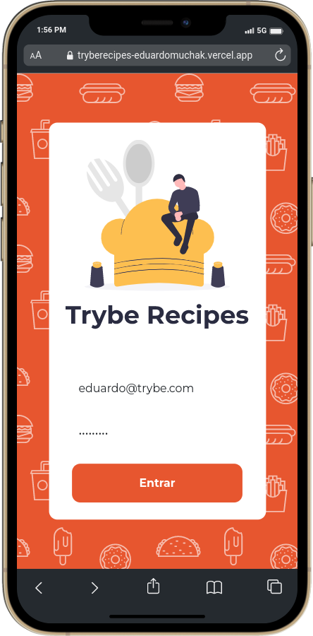
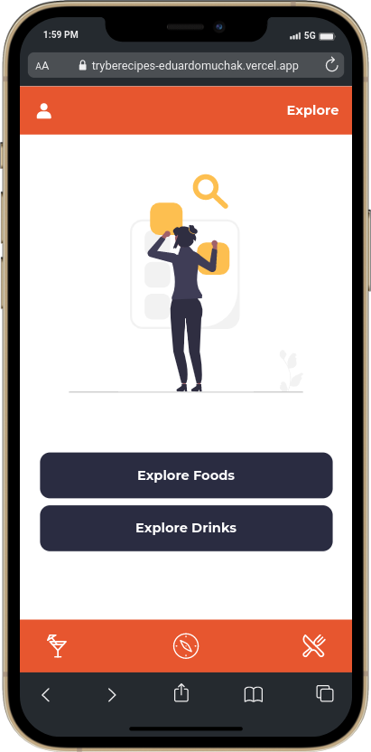
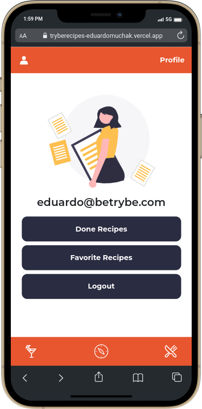
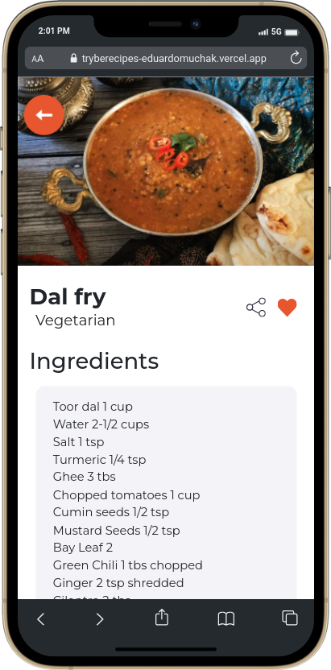

<p align="center">
<h1 align="center"> Trybe Recipes - Responsive Landing Page </h1>
<h2 align="center">Vercel:</h2>
 
 <div align="center">
   <a href="https://brunojlee-trybe-recipes.vercel.app/" target="_blank">
    
 </div>
 
<h5 align="center">Clique na imagem</h5>
  
## 👩🏾‍💻Desenvolvido por


<a href="https://www.linkedin.com/in/brunojlee/" target="_blank"></a>

<a href="https://www.linkedin.com/in/eduardomuchak/" target="_blank"></a>

<a href="https://www.linkedin.com/in/leonardo-begnossi-41580a127/" target="_blank"></a>

<a href="https://www.linkedin.com/in/leonardo-begnossi-41580a127/" target="_blank"></a>

<a href="https://www.linkedin.com/in/jordaorafaela/" target="_blank"></a> 

---
<p align="center">
 <a href="https://brunojlee-trybe-recipes.vercel.app/" target="_blank">
  
 </a>
</p>
</br>
## 💡 Sobre o Projeto

O Trybe Recipes é uma versão mobile, otimizado para a resolução 360 x 640 , com consultas as APIs MealDB e CocktailsDB e manipulação de localStorage de um **Site de Receitas**.
A partir dessas demandas, desenvolvemos uma aplicação onde os usuários poderão:

- Visualizar as receitas de comidas e drinks, presentes na base de dados das APIs;
- Interagir com as receitas, marcando-as como favoritas, compartilhando-as e riscando seus ingredientes conforme necessidade;
- Caso alguma receita seja marcada como favorita, ela se encontrará no perfil do usuário logado;
- Interagir com as receitas recomendadas através do carousel.

## 🗺 Roteiro de Desenvolvimento

1. Fizemos a análise dos requisitos presentes no modelo de negócio do desafio através do figma proposto;
2. Dividimos nossa operação em etapas diárias de reuniões e desenvolvimento através das plataformas Zoom, Slack e Discord;
3. Após o desenvolvimento dos scripts, nos dividimos novamente entre estilização e desenvolvimento dos testes.

## 🛠 Tecnologias Usadas

- HTML5
- CSS3
- Javascript
- React.Js
- React Router
- ContextAPI
- React Icons
- Tailwind CSS
- Swiper


## 🎲 Base de dados

Como base de dados para a aplicação utilizamos as APIs:
https://themealdb.com/
https://thecocktaildb.com/

## Screenshots:

<p align="center">
  
</p>
</br>
<p align="center">
  
</p>
</br>
<p align="center">
  
</p>
</br>
<p align="center">
  
</p>

## 🧙‍♂️ Como Iniciar o Projeto

Primeiro faça a clonagem do projeto em algum diretorio do seu computador:

```bash
> cd "users/usuario/desktop/trybe-recipes"
> git clone git@github.com:brunojlee/trybe-recipes.git
```

Depois disso instale as dependências:

```bash
> npm install
```

O projeto iniciará em seu navegador padrão, através do endereço: http://localhost:3000/ .
